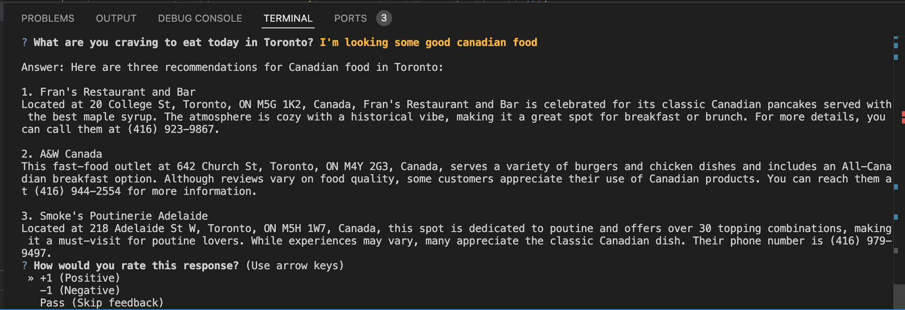
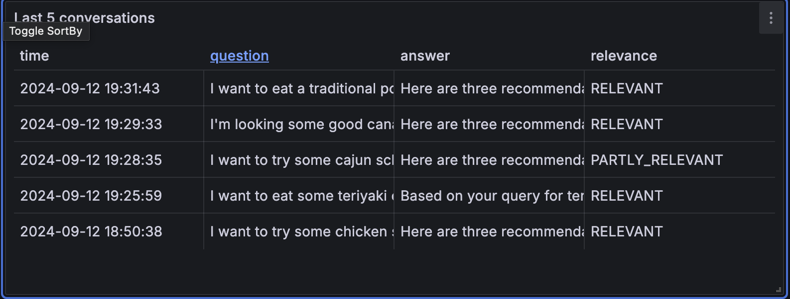
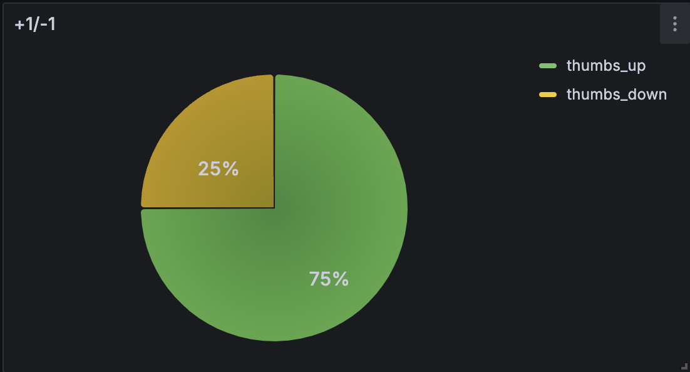
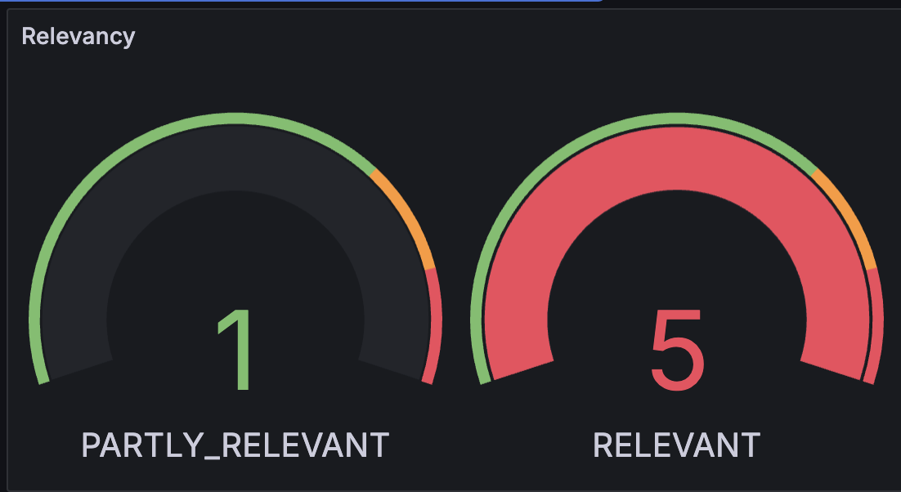
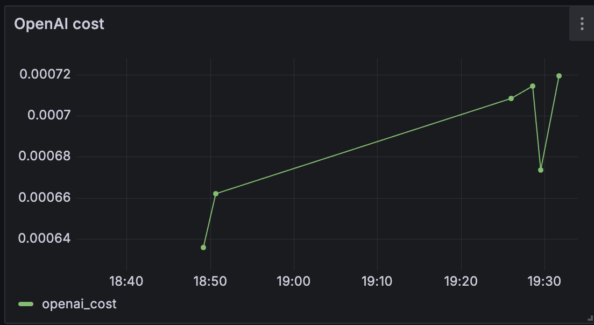
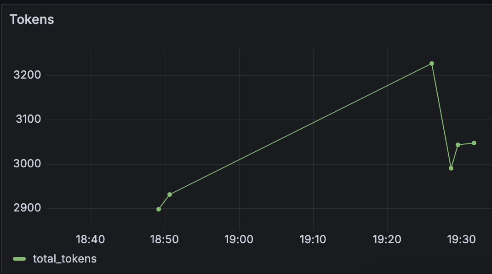
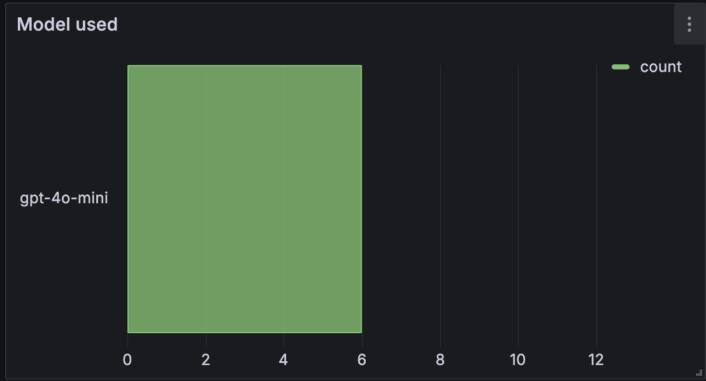
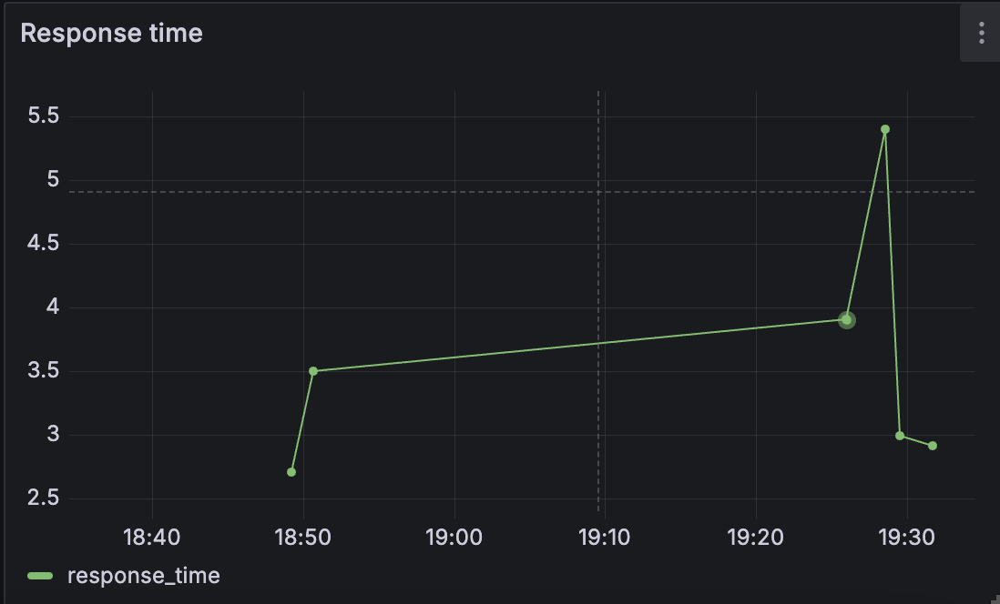

# Restaurant Suggestion Toronto (RAG)


## Overview

Restaurant Suggestion Toronto (RAG) is a Retrieval-Augmented Generation (RAG) application designed to provide personalized restaurant suggestions in Toronto. By leveraging the Google Places API and advanced AI technologies, this project allows users to interact with a chatbot to get restaurant recommendations based on specific meal preferences, vibes, or cuisines in the Toronto area.



## Problem Description

In a bustling city like Toronto, there are thousands of restaurants offering diverse dining experiences. Whether you're a local or a visitor, it can be overwhelming to find the perfect place to eat that matches your specific tastes and needs. Traditional restaurant discovery tools often flood users with generic options, failing to cater to individual preferences like specific dishes, ambiance, or cuisine types.

### Why is this important?

- **Personalized recommendations**: Current platforms may suggest popular restaurants, but they often lack the granularity required to suggest restaurants based on meal preferences or specific experiences.
- **Efficient decision-making**: Instead of browsing through endless lists of restaurants, users can directly interact with the assistant to receive tailored suggestions that suit their needs.
- **Enhanced dining experience**: The application helps improve the overall dining experience by directing users to places that match their exact expectations, whether it’s a casual brunch spot or a fine dining establishment.

## Functionality

The core functionality of the Restaurant Suggestion Toronto (RAG) application revolves around a conversational assistant that users can interact with to receive restaurant recommendations. The assistant leverages the dataset mentioned above to provide relevant suggestions based on user queries.

### Key Features

- Restaurant recommendations based on specific dishes: Users can search for restaurants offering a particular dish (e.g., "Where can I find the best sushi?").
- Vibe-based suggestions: Users can search for restaurants with a particular ambiance (e.g., "Suggest a cozy place for dinner.").
- Cuisine-specific recommendations: Users can look for restaurants offering a certain type of cuisine (e.g., "Find an Italian restaurant near me.").
- Meal type filtering: Users can refine their search based on meal type (e.g., "Show me breakfast spots.").

### How it works

1. User query: Users input their preferences (e.g., dish name, vibe, cuisine type) into the chatbot interface.
2. Retrieval process: The system searches through the summarized reviews and data to find matching restaurants based on the query.
3. Response generation: The chatbot generates a personalized recommendation, complete with a brief description of the restaurant, its location, key dishes, and the overall vibe.

## Data Description

The data used in this project is sourced from the Google Places API. The dataset includes 2000 restaurant records, each containing customer reviews. Each restaurant's reviews have been condensed into one comprehensive summary using the ChatGPT-4o-mini model. The summary focuses on:

- **Dishes**: Highlighting the most popular or signature dishes offered by the restaurant.
- **Vibes**: Summarizing the overall ambiance of the restaurant (e.g., cozy, lively, romantic).
- **Types of meals**: Whether the restaurant specializes in breakfast, lunch, dinner, or other meal types.

The data structure includes the following fields:
- Restaurant name
- Location
- Summarized review
- Cuisine type
- Price range

The dataset is located in the `data` folder under `clean_data.csv`.

## Technologies

- Python 3.12.
- Docker and Docker Compose for containerization.
- [Minsearch](https://github.com/alexeygrigorev/minsearch) for full-text search.
- Flask as the API Interface.
- OpenAI as an LLM (gpt-4o-mini)
- Grafana for monitoring and PostgreSQL as the backend for it

## Running it

## Running it with Docker 

The easiest way to run this application is with docker

```bash
docker-compose up
```

## Preparation

### Installing the dependencies

If you don't use docker and want to run locally, you need to manually prepare the environment and install all the dependencies.

We use `pipenv` for managing dependencies and Python 3.12

Make sure you have pipenv installed:

```bash
pip install pipenv
```

Installing the dependencies:

```bash
pipenv install --dev
```

## Runnning locally

### Database configuration

Before the application starts for the first time, the database needs to be initialized.

First, run `postgres`:

```bash
docker-compose up postgres
```

Then run the [db_prep.py](recommendation_eat_assistant_flask/db_prep.py) script:

```bash
pipenv shell

cd recommendation_eat_assistant_flask

export POSTGRES_HOST=localhost
python db_prep.py
```

To check the content of the database, use `pgcli`(already installed with pipeng):

```bash
pipenv run pgcli -h localhost -U your_username -d course_assistant -W
```

You can view the schema using the `\d` command:

```bash
\d conversations;
```

And select from this table:

```SQL
select * from conversations;
```

### Running with Docker (without compose)

Sometimes you might want to run the application in Docker without Docker Compose. Now, you need to build the image:

```bash
docker build -t recommendation_eat_assistant_flask .
```

And run it:

```bash
docker run -it --rm \
    -e OPENAI_API_KEY=${OPENAI_API_KEY} \
    -e DATA_PATH="data/clean_data.csv" \
    -p 5000:5000 \
    recommendation_eat_assistant_flask
```

### Running the application with Docker-Compose:

The easiest way to run the application is with `docker-compose`:

```bash
docker-compose up
```

### Running locally

If you want to run the application locally, start only postgres and grafana:

```bash
docker-compose up postgres grafana
```

If you previously started all applications with `docker-compose up`, you need to stop the `app`:

```bash
docker-compose stop app
```

Now run the app on your host machine:

```bash
pipenv shell

cd recommendation_eat_assistant_flask

export POSTGRES_HOST=localhost
python app.py
```

### CURL

Running the Flask application:

```bash
pipenv run python app.py
```

### Preparing the application

Before we can use the app, we need to initialize the database. We can do it by running the [`db_prep.py`](recommendation_eat_assistant_flask/db_prep.py)

```bash
cd recommendation_eat_assistant_flask

pipenv shell

export POSTGRES_HOST=localhost
python db_prep.py
```

### Using the application

First, you need to start the application either with docker-compose or locally.

When it's running, let's test it:

```bash
URL=http://localhost:5000
QUESTION="I want to try some chicken spicy wings"
DATA='{
    "question": "'${QUESTION}'"
}'

curl -X POST \
    -H "Content-Type: application/json" \
    -d "${DATA}" \
    ${URL}/question
```

The recommendation will look like this:

```json
{
  "answer": "Here are three recommendations for trying spicy chicken wings in Toronto:\n\n1. Wow! Wing House\n   - Address: 772 College St, Toronto, ON M6G 1C6, Canada\n   - Phone: (647) 547-5779\n   - This restaurant is known for its extensive selection of over 100 wing flavors. Customers particularly enjoy options like the \"Devils Ranch Wings,\" which are favored for their spicy profile. Be prepared for potential wait times, but the wings themselves are praised for their crispy exterior and juicy interior.\n\n2. The Wing Shop\n   - Address: 211 Queen St E, Toronto, ON M5A 1S2, Canada\n   - Phone: (416) 682-1010\n   - Known for its unique sauce flavors like Spicy Garlic Parmesan and Mango Habanero, The Wing Shop offers large and juicy portions. While reviews are mixed, many patrons appreciate the great deals on wings, making it a popular choice for casual dining.\n\n3. St. Louis Bar & Grill\n   - Address: 595 Bay St. A09, Toronto, ON M5G 2R3, Canada\n   - Phone: (416) 668-0688\n   - This bar is recognized for its vibrant atmosphere and menu featuring various chicken wings, which can be made to order with various spice levels, including very spicy options. The attentive staff ensures an enjoyable dining experience, particularly during game nights.",
  "conversation_id": "aac10bf9-7491-4018-9d8d-8e423470ec0a",
  "question": "I want to try some chicken spicy wings"
}
```

Sending feedback:

```bash
ID="aac10bf9-7491-4018-9d8d-8e423470ec0a"
URL=http://localhost:5000
FEEDBACK_DATA='{
    "conversation_id": "'${ID}'",
    "feedback": 1
}'

curl -X POST \
    -H "Content-Type: application/json" \
    -d "${FEEDBACK_DATA}" \
    ${URL}/feedback
```

After sending it, you'll receive the acknowledgment:

```json
{
    "message": "Feedback received for conversation aac10bf9-7491-4018-9d8d-8e423470ec0a: 1"
}
```

## Using the application

When the application is running, we can start using it.

### CLI

You can use the following python script to use the application

```bash
pipenv run python cli.py
```

You can also play with the [ground_thruth_dataset](data/ground-truth-retrieval.csv)

```bash
pipen run python cli.py --random
```

### Using `requests`

Alternatively, you can use [test.py](test.py) for testing it:

```bash
pipenv run python test.py
```

### Misc

Running Jupyter notebook for experiments:

```bash
cd notebooks
pipenv run jupyter notebooks
```

## Interface

We use Flask for serving the application as API. 

Refer to [Running the application](#running-the-application) for more detail.

## Ingestion

The ingestion script is in [recommendation_eat_assistant_flask/ingest.py](recommendation_eat_assistant_flask/ingest.py) and it's run on the startup of the app ([recommendation_eat_assistant_flask/rag.py](recommendation_eat_assistant_flask/rag.py)).

## Code

The code for the flask application is in the [recommendation_eat_assistant_flask](recommendation_eat_assistant_flask/) folder:

- [`app.py`](recommendation_eat_assistant_flask/app.py) - The Flask API, the main entrypoint to the application
- [`rag.py`](recommendation_eat_assistant_flask/rag.py) - The main RAG logic for building the retrieving the data and building the prompt
- [`ingest.py`](recommendation_eat_assistant_flask/ingest.py) - loading the data into the knowledge base
- [`minsearch.py`](recommendation_eat_assistant_flask/minsearch.py) - an in-memory search engine
- [`db.py`](recommendation_eat_assistant_flask/db.py) - the logic for logging the requests and responses to postgres
- [`db_prep.py`](recommendation_eat_assistant_flask/db_prep.py) - the script for initializing the database

There are some code in the project root directory:

- [`test.py`](test.py) - a script for testing the app with a predefined question
- [`cli.py`](cli.py) - interactive CLI for the APP

## Experiments 

For experiments, we use Jupyter Notebooks. They are in the [`notebooks`](notebooks/) folder.

To start Jupyter run:

```bash
cd notebooks
pipenv run jupyter notebooks
```

There are the following notebooks:

- [`clean_data.ipynb`](notebooks/clean_data.ipynb) A script to clean the data
- [`rag-test.ipynb`](notebooks/rag-test.ipynb) The RAG flow and evaluating the system
- [`rag-test-elasticsearch.ipynb`](notebooks/rag-test-elasticsearch.ipynb) The RAG flow and evaluating the system using ElasticSearch
- [`evaluating-data-generation.ipynb`](notebooks/evaluation-data-generation.ipynb) Generating the ground truth dataset for retrieval evaluation

## Evaluation

For the code for evaluating the system, you can check the [notebooks/rag-test.ipynb](notebooks/rag-test.ipynb) notebook.

### Retrieval

**Minsearch**

You can look at the [notebooks/rag-test.ipynb](notebooks/rag-test.ipynb) the process evaluation of elastic search.

The basic approach - using minsearch without any boosting - gave the following metrics:

- hit_rate: `58%`
- MRR: `45%`

The current system's hit rate of 58% and MRR of 45% can be attributed to the challenge of retrieving relevant results from a dataset of 2,000 restaurant records. Due to the size of the dataset, the retrieval model must efficiently sift through a large volume of information, increasing the likelihood of lower accuracy in matching the user's specific request. Furthermore, the complexity of the queries, which often involve preferences for specific meals, vibes, or cuisines, adds another layer of difficulty in pinpointing the optimal suggestion. As a result, the retrieval process can yield suboptimal matches, affecting both the hit rate and the MRR. Improving the precision of the search and ranking algorithm is essential to enhance the overall performance of the system.

The improved version (with better boosting)

- hit_rate: `71%`
- MRR: `54%`

The best boosting parameters:

```python
boost = {
    'displayname': 1.07,
    'primarytype': 0.14,
    'editorialsummary': 1.25,
    'reviews': 2.79
}
```

**Elasticsearch**

You can look at the [notebooks/rag-test-elasticsearch.ipynb](notebooks/rag-test-elasticsearch.ipynb) the process evaluation of elastic search.

The text search gave the following metrics

- hit_rate: `14%`
- MRR: `10%`

The vector search the following metrics.

- hit_rate: `33%`
- MRR: `21%`

This values are not compared with the value obtained in minsearch, therefore, the minsearch function is selected as a the retrieval function.

### RAG flow

We used the LLM-as-a-Judge metric to evaluate the quality of our RAG flow

For `gpt-4o-mini`, among 200 records, we had:

- 100 % Relevant
- 0 % Partly_revelant
- 0 % Irrelevant

We also tested `gpt-4o`

- 100 % Relevant
- 0 % Partly_revelant
- 0 % Irrelevant

We opted for using `gpt-4o-mini`.

## Monitoring

We use Grafana for monitoring the application

It's accesible at [localhost:3000](http://localhost:3000)

- Login: "admin"
- Password: "admin"

### Dashboards

 

1. This display a table with the last 5 conversations. It includes details such as the question, answer, relevance, and timestamps.



2. A pie chart that visualizes the feedback from the users, showing the positive counts (+1) and the negtive (-1) feedbacks. It helps track user satisfaction.



3. Some gauges charts representing the relevance of the responses provided during the conversations. 



4. A time series graph depicting the cost associated with OpenAI usage over time. This panel helps monitor and anlyze the expenditure linked to the AI model's usage



5. Another time series tracking the number of tokens used in the conversations over time. This helps to understand the usage patterns and the volume of data processed.



6. A bar chart displaying the count of conversations based on the different models used. This panel provides insights into which AI models are most frequently used



A time series chart showing the response time of conversations over time.

### Setting up Grafana

All Grafana configurations are in the grafana folder:

- [init.py](grafana/init.py) for initializing the datasource and the dashboard
- [dashboard.json](grafana/dashboard.json) the dashboard taken from the LLM Zoomcamp without changes

To start the dashboard, first ensure Grafana is running and then go to [localhost:3000](http://localhost:3000).